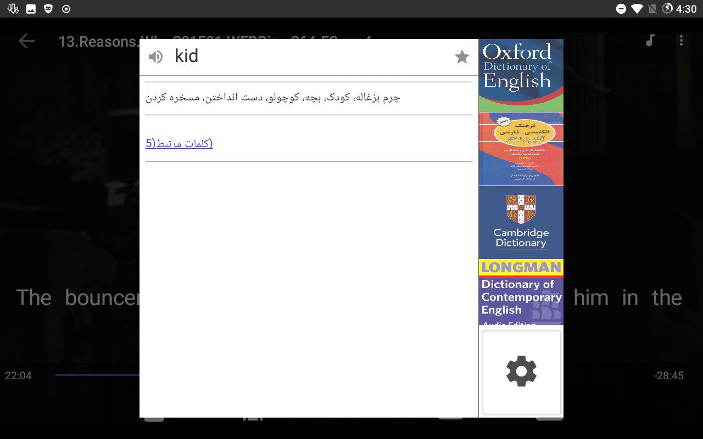
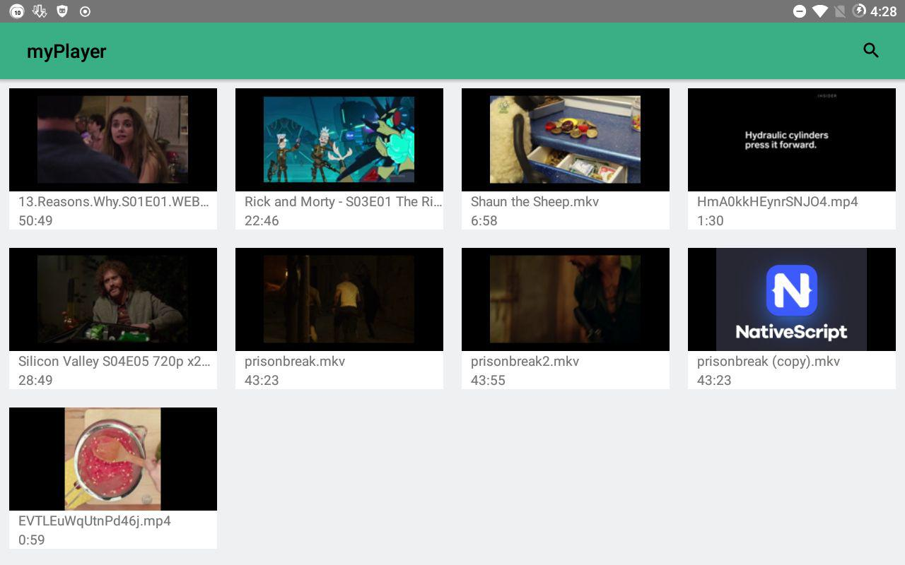
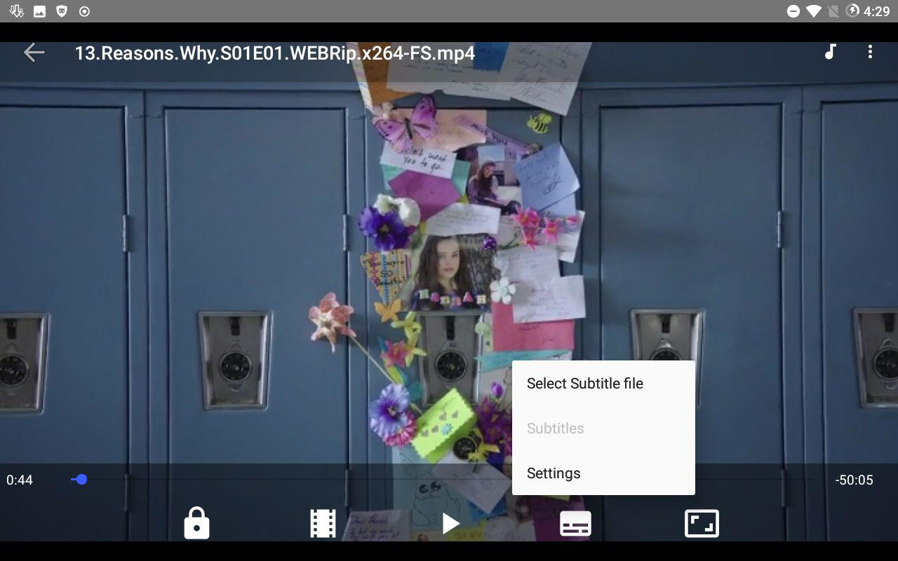
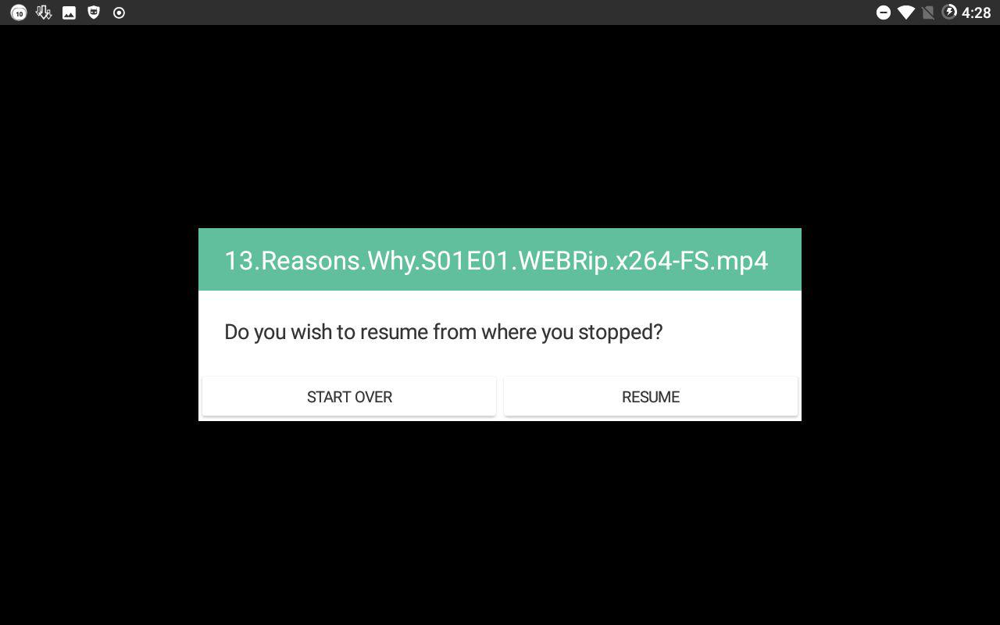
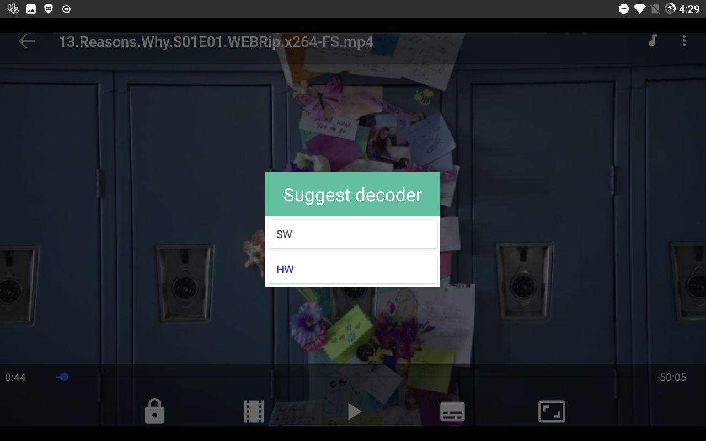
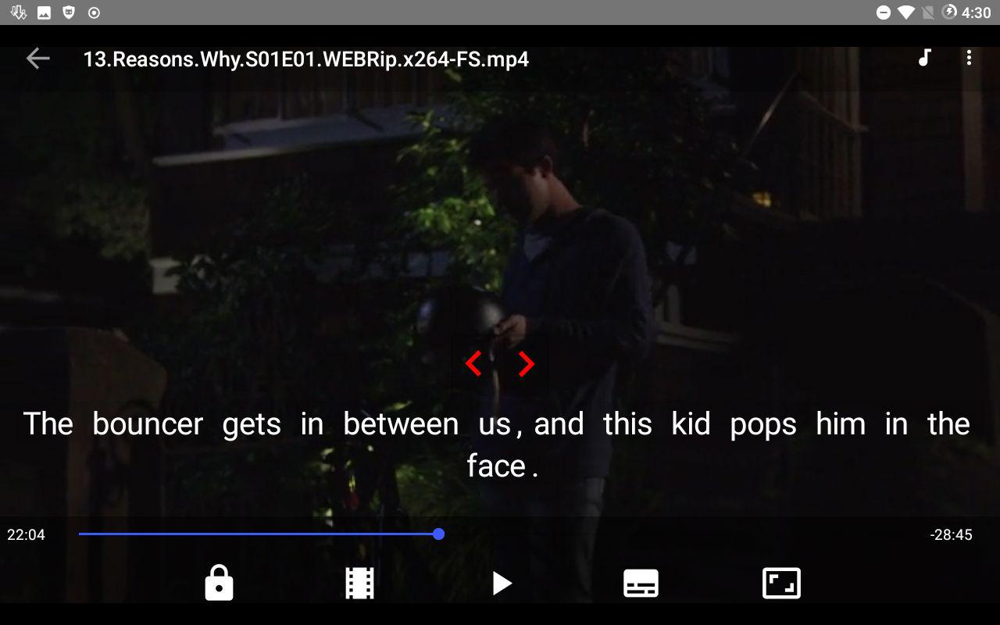

# nativescript_Lingua_Player
The nativescript version of [LinguaPlayer](https://github.com/LinguaPlayer/android_lingua_player)

This project never completed [Link of new project](https://github.com/LinguaPlayer/android_lingua_player)

Created with nativescript , libvlc and my [nativescript vlc plugin](https://github.com/kazemihabib/nativescript-vlc-player
)

#License
[GPLV3](https://github.com/kazemihabib/nativescript_Lingua_Player/blob/master/License)
